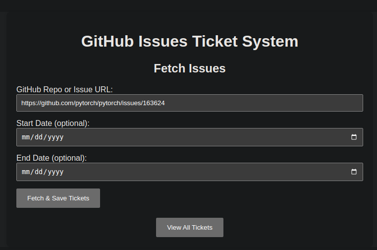
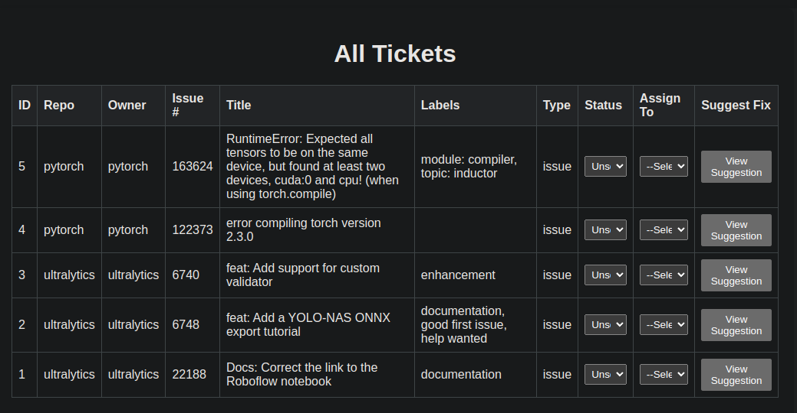
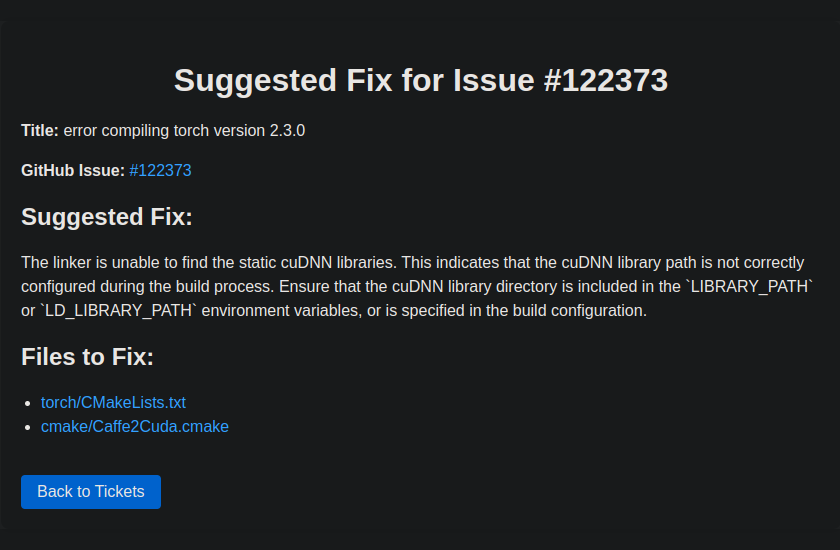

# GitHub Issues AI Agent 

This project is a **practice/demo** for using **Google ADK (Agent Development Kit)** AI agents and **MCP (Model Content Protocol)** integration in a Django web application. It demonstrates how AI agents can interact with GitHub issues to create tickets and suggest fixes, including which files may need modification.

---

---

## System Design

.png)

The diagram above illustrates the complete system architecture showing how Django, ADK agents, and MCP work together to process GitHub issues and generate AI-powered suggestions.

---


## What is Google ADK?

Google ADK (Agent Development Kit) is a framework for building AI agents that can perform complex tasks via natural language instructions. ADK agents can:
- Read inputs (e.g., GitHub issue text)
- Process the data using a large language model
- Produce structured outputs (JSON, suggestions, etc.)
- Interact with other services or tools programmatically

This project uses ADK to create **GitHub Issue AI agents** for two main tasks:
1. **Fetching issues** from a GitHub repository or issue URL.
2. **Suggesting fixes** for issues, including which files need attention.

---

## What is MCP?

MCP (Model Context Protocol) is an open protocol that enables AI models and assistants to securely connect to external data sources, tools, and services. It provides a standardized way for AI agents to access real-world information and perform actions beyond their training data.

**Key MCP Benefits:**
- **Secure Integration:** Controlled access to external systems without exposing sensitive data
- **Standardized Interface:** Consistent protocol for connecting AI models to various data sources
- **Extensibility:** Support for custom tools and integrations
- **Real-time Data:** Access to live data from APIs, databases, and services

In this project, MCP is used to:
- Enable secure communication between AI agents and GitHub's API
- Provide structured access to GitHub repositories and issues
- Handle authentication and data retrieval automatically
- Ensure consistent data formatting between different systems

This project leverages the **GitHub MCP Server** and its tools from [github/github-mcp-server](https://github.com/github/github-mcp-server) to interact with GitHub repositories programmatically.

---

## Features

- Fetch GitHub issues using a GitHub issue URL or repository.
- Create and store tickets in a Django database.
- Assign tickets to users and track status (solved/unsolved).
- AI agent suggests concise fixes for issues.
- Suggests specific files to fix for each issue.
- Web interface for managing tickets and viewing AI suggestions.
- Demonstrates **ADK agent integration and MCP usage**.

---

## Project Structure

```
github_issues_project/
├── adk_agents/                     # AI agents folder (practice/demo agents)
│   ├── github_suggest_fix/         # Agent for suggesting fixes
│   └── github_mcp/                 # Agent for fetching issues
├── issues/                         # Django app for tickets and integration
│   ├── migrations/
│   ├── models.py                   # Ticket model
│   ├── views.py                    # Views for listing/updating tickets
│   ├── services/                   # Service layer for ADK integration
│   │   ├── adk_integration.py
│   │   └── suggest_fix_integration.py
│   └── templates/                  # HTML templates
├── github_issues_project/          # Django project config
├── manage.py                       # Django CLI
├── requirements.txt                # Python dependencies
└── README.md
```
## Demo Screenshots

### 1. Home Page
**URL:** `http://127.0.0.1:9000/`



The main interface where users can submit GitHub issue URLs to create tickets.

### 2. View All Tickets
**URL:** `http://127.0.0.1:9000/issues/view-tickets/`



Displays all created tickets with their status, assignee, and options to view AI suggestions.

### 3. AI Suggestion Page
**URL:** `http://127.0.0.1:9000/issues/suggest_fix_for_issue/5/`



Shows AI-generated fix suggestions and specific files that need modification for the selected issue.

---
---

## Installation

1. Clone the repository:
```bash
git clone <repo_url>
cd github_issues_project
```

2. Create a Python virtual environment:
```bash
python -m venv .venv
source .venv/bin/activate
```

3. Install dependencies:
```bash
pip install -r requirements.txt
```

4. Create `.env` file in root (and in each agent folder if needed) with:
```ini
GOOGLE_API_KEY=<your_key_here>
```

5. Apply Django migrations:
```bash
python manage.py migrate
```

6. Create superuser:
```bash
python manage.py createsuperuser
```

7. Run the Django server:
```bash
python manage.py runserver
```

8. Optional: Start ADK agents web interface:
```bash
adk web
```

## Usage

1. Open your browser at `http://127.0.0.1:8000/`
2. Create tickets by providing GitHub issue URL.
3. View tickets and update their status or assign users.
4. Click **View Suggestion** to see AI-suggested fixes and files to modify.

This setup demonstrates how AI agents can automate issue handling using ADK and MCP.

## Flow Summary Diagram 

```
User (Browser)
    |
    |---[Submit GitHub URL]---> Django create_tickets_view
                                   |
                                   v
                        adk_integration.get_issues_from_url
                                   |
                   -------------------------------
                   | ADK CLI Replay | ADK Web UI |
                   -------------------------------
                                   |
                               JSON issues
                                   |
                        Save issues in Django DB
                                   |
                        view_tickets.html renders
                                   |
                   User clicks "View Suggestion"
                                   |
                      suggest_fix_view(ticket_id)
                                   |
                  suggest_fix_integration.get_suggested_fix_for_issue
                                   |
                              ADK Agent
                                   |
                        JSON: suggested_fix + files
                                   |
                        suggest_fix.html renders
```

## Notes

- Ensure your `.env` has a valid `GOOGLE_API_KEY`.
- Agents must be placed under `adk_agents/`.
- ADK CLI should be installed and available in your system path.